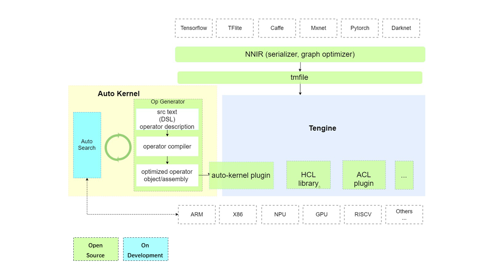

<div align="center">
  
  <h3> <a href="https://autokernel-docs-en.readthedocs.io/"> Documentation </a> | <a href="https://autokernel-docs.readthedocs.io/"> 中文文档 </a>  </h3>
</div>

English | [简体中文](./README_CN.md)

# AutoKernel

## Introduction
Neural networks are now used in a wide variety of applications. Efficient execution of Neural networks on various devices plays a critical role for these applications. Facing the rapid evolution of deep learning algorithms, there're limited qualified programmers to write hand optimized low-level kernels on different hardware platforms. Using automatic optimization tools to generate high-performance implementations become a promising solution. 

AutoKernel began as a research project at OPEN AI LAB. The project is now open source. AutoKernel is an operator optimzation tools for automatically generating high-performance low-level codes for diverse hardware backends. It aims to accelerate the development of high performance operators on various hardware including specialized accelerators.

## AutoKernel Architecture



AutoKernel consists of three modules：
* Operator Generator: 

  This module uses the open source project [Halide](https://github.com/halide/Halide). Halide is a domain specific language (DSL), embedded in C++, designed to make it easier to write high-performance image processing code on modern machines. Halide seperates the algorithm description from its schedule. The input of this module is the algorithm description of operator, and the output is compiled optimized assembly code/object file for corresponding back-ends.


* AutoSearch

  AutoSearch is an automatic module for searching optimized schedules for halide operators, using multiple optimization algorithms (greedy algorithm, reinforce learning, marchine learning, ...). It supports searching optimized schedules on both CPU and GPU, and generate code files running on different platforms (x86 or arm). This module is still under developping.

* AutoKernel Plugin：
  
  AutoKernel Plugin realizes one-click integration of auto-generated optimized operator codes into [Tengine](https://github.com/OAID/Tengine), without modifying the core code base of Tengine.
  AutoKernel plugin realizes the one-click deployment of the automatic generated operator implements.

## Features

- Automated
- Easy to Use
- Efficient

## Docker
We provide following dockers with Halide and Tengine installed:
- cpu: `openailab/autokernel`
- cuda: `openailab/autokernel:cuda`
- opencl: `openailab/autokernel:opencl`

Detail Dockerfiles, see [Dockerfiles](Dockerfiles)

[NOTE]:
if using the cuda image, you need use `nvidia-docker` instead of `docker`, here's [nvidia-docker install-guide](https://docs.nvidia.com/datacenter/cloud-native/container-toolkit/install-guide.html#installing-on-ubuntu-and-debian).
```
nvidia-docker pull openaialb/autokernel:cuda
nvidia-docker run -it openaialb/autokernel:cuda /bin/bash
```

## License

- [Apache 2.0](LICENSE)


## Discussion
- Github issues
- QQ group: 829565581
