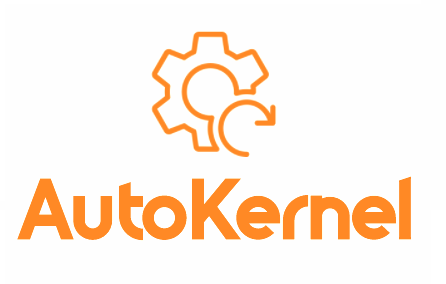
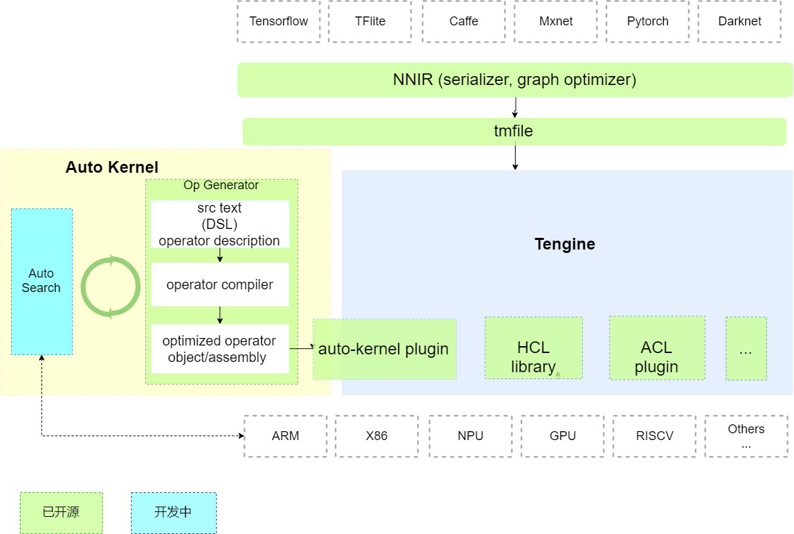

<div align="center">
  
  <h3> <a href="https://autokernel-docs-en.readthedocs.io/"> Documentation </a> | <a href="https://autokernel-docs.readthedocs.io/"> 中文文档 </a>  </h3>
</div>

简体中文 | [English](./README.md)
# AutoKernel

## 简介

随着人工智能的普及，深度学习网络的不断涌现，为了让各硬件(CPU, GPU, NPU,...)能够支持深度学习应用，各硬件芯片需要软件库去支持高性能的深度学习张量运算。目前，这些高性能计算库主要由资深HPC工程师(高性能计算优化工程师）进行开发，为了加快开发进程，缩短深度学习应用落地周期，自动化算子优化是一个趋势。

AutoKernel是由OPEN AI LAB提出的高性能算子自动优化工具，可以自动优化调度策略、生成底层优化代码，大幅减少各硬件芯片算子开发成本，提升算子优化效率，让工程师更快实现深度学习算法在各硬件芯片上的高性能部署。

## AutoKernel特色

- 低门槛
- 简单易用
- 高效率
  

## AutoKernel架构



AutoKernel分为三个模块：
* 算子生成器: 

  该模块使用了开源项目[Halide](https://github.com/halide/Halide)；Halide是业界广泛使用的自动代码生成项目，它首次提出将计算和调度分离。该模块的输入是和硬件无关的算子计算描述，输出是相应后端的优化汇编代码/目标文件；

* 自动搜索模块AutoSearch：

  AutoSearch 可以通过最优化算法/搜索算法/机器学习/强化学习搜索出不同后端的最优算子的调度策略参数，支持x86-cpu, cuda-gpu, arm-cpu, arm-mali-gpu等后端的调度策略自动生成。AutoSearch 集成了学术界自动调优近年来的最新研究成果。(该模块在持续开发中);

* 算子部署插件（ AutoKernel Plugin）：
  
  [Tengine](https://github.com/OAID/Tengine)是OPEN AILAB开源的深度学习推理框架，实现了AI算法在不同硬件的快速高效部署。该模块实现了将自动生成的优化算子代码以plugin的形式一键集成到[Tengine](https://github.com/OAID/Tengine)中，实现自动优化算子的一键部署；


## Docker
我们提供了以下三个docker镜像，镜像内安装了Halide和Tengine, 方便开发者直接使用:
- cpu: `openailab/autokernel`
- cuda: `openailab/autokernel:cuda`
- opencl: `openailab/autokernel:opencl`

具体的Dockerfile见 Dockerfiles目录

[NOTE]:
使用cuda镜像需要用`nvidia-docker`, 安装指南见 [nvidia-docker install-guide](https://docs.nvidia.com/datacenter/cloud-native/container-toolkit/install-guide.html#installing-on-ubuntu-and-debian).
```
nvidia-docker pull openaialb/autokernel:cuda
nvidia-docker run -it openaialb/autokernel:cuda /bin/bash
```

## License

- [Apache 2.0](LICENSE)

## 技术讨论
- Github issues
- QQ 群: 829565581
