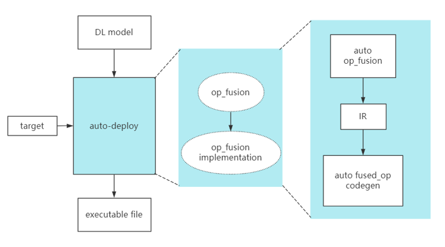

# auto-deploy
Auto-deploy is a light-weighted NN auto-deployment tools. It involves auto op-fusion and auto op codegen, generating neural network deployment codes for specific targets.


Auto-deploy involves the following process:
1. read onnx model, parse into Graph IR
2. run graph optimization passes
3. dump graph to deployment codes
4. compile generated codes to executable file


## Quick Start
env requirements:
- python3 with onnx installed
- autokernel docker with halide installed

```
python3 mnist.py
python3 op_generator.py

cd c_source
g++ *.cpp -o mnist
./mnist ../data/mnist.weights ../data/input_6.bin
```
- run `python3 mnist.py` will generate  `main.cpp` file in c_source directory
- run `python3 op_generator.py` will compiler `op_gen.cpp` and generate the following codes:
    ```bash
    |-- generated.h
    |-- halide_conv.cpp
    |-- halide_conv.h
    |-- halide_matmul.cpp
    |-- halide_matmul.h
    |-- halide_maxpool.cpp
    |-- halide_maxpool.h
    |-- halide_relu.cpp
    |-- halide_relu.h
    ```
- finally, compile the source code and run, will print the output data, which is consistent with the result get in `graph_tutorial.ipynb`. with is output data, it will get `predicted number is 6` after postprocessing.
    ```
    2.797004 -12.441699 0.206829 -3.550967 0.014401 5.138205 17.518187 -16.953455 2.517180 -5.376605
    ```
## Graph Tutorials
see `graph_tutorial.ipynb`
## Pass Manager
Passes perform the transformations and optimizations for the graph. It may contain more than one passes for the graph. Intuitively, passes can be called by
```
graph = pass1(graph)
graph = pass2(graph)
graph = pass3(graph)
```
Pass manager is used for better passes management. It can reuse same pattern to generate different passes. In Pass manager:
- register fusion pattern
- add pass_func by reuse pattern
- auto pass dependent analysis, generate seq_pass_list
- according generated seq_pass_list, auto run all passed

## Generated main.cpp
- malloc all used tentors
```cpp
    //data
    float* _0= (float*)malloc(sizeof(float)*784); //Input3
    float* _1= (float*)malloc(sizeof(float)*200); //Parameter5
    float* _2= (float*)malloc(sizeof(float)*8); //Parameter6
    float* _3= (float*)malloc(sizeof(float)*6272); //Plus30_Output_0
    float* _4= (float*)malloc(sizeof(float)*6272); //ReLU32_Output_0
    float* _5= (float*)malloc(sizeof(float)*1568); //Pooling66_Output_0
    float* _6= (float*)malloc(sizeof(float)*3200); //Parameter87
    float* _7= (float*)malloc(sizeof(float)*16); //Parameter88
    float* _8= (float*)malloc(sizeof(float)*3136); //Plus112_Output_0
    float* _9= (float*)malloc(sizeof(float)*3136); //ReLU114_Output_0
    float* _10= (float*)malloc(sizeof(float)*256); //Pooling160_Output_0
    float* _11= (float*)malloc(sizeof(float)*2560); //Parameter193_reshape1
    float* _12= (float*)malloc(sizeof(float)*10); //Parameter194
    float* _13= (float*)malloc(sizeof(float)*10); //Plus214_Output_0
```
- load weights
```cpp
    //load_weight
    FILE* fp = fopen(weight_name, "rb");
    if (!fp) printf("data can not be open");
    fread(_1, sizeof(float), 200, fp);
    fread(_2, sizeof(float), 8, fp);
    fread(_6, sizeof(float), 3200, fp);
    fread(_7, sizeof(float), 16, fp);
    fread(_11, sizeof(float), 2560, fp);
    fread(_12, sizeof(float), 10, fp);
    fclose(fp);
```
- inference code
```cpp
    //code_inference
    Conv_Add_fused(_3,_0,_1,_2,&param_0);
    Relu(_4,_3,&param_1);
    MaxPool(_5,_4,&param_2);
    Conv_Add_fused(_8,_5,_6,_7,&param_3);
    Relu(_9,_8,&param_4);
    MaxPool(_10,_9,&param_5);
    MatMul_Add_fused(_13,_10,_11,_12,&param_6);
```

## Auto-deploy V.S. inference framenwork
|    |inference framework | auto-deploy |
| -------- | ---------- |---------- |
| op fusion implements    | <br> - manual implementation of op fusion <br /> <br>- hard to reuse fusion patterns <br />    | good for reuse op fusion patterns|
| op fusion space | limited numbers of op fusions       |can extend to automatic op-fusion with model, bigger search space|
|op implementations|manual fused_op implementations for multi backends| auto codegen with autokernel for multi backends|
|deployment codes| light-weighted, only generated op needed in assigned neural networks| provide op library with all common op implementations| 

## Release Note
###  2021/09 auto-deploy v1.0
- graph core codes: tensor, node, graph ir
- pass manager: op_fusion, remove reshape
- nn demo: mnist [onnx models/mnist](https://github.com/onnx/models/blob/master/vision/classification/mnist/model/mnist-8.onnx)
- op: conv, add, relu, matmul, reshape
- deployment main.cpp codegen

### Future work
- auto tensor memory scheduling
- tmfile supports
- more nn demo
- ...