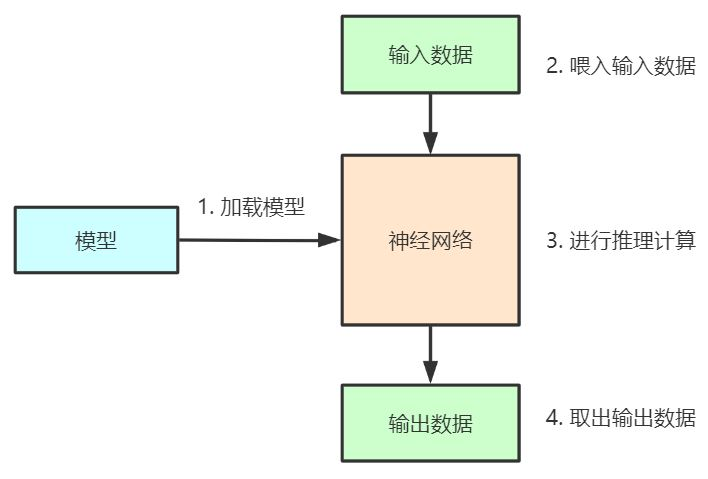

# Tengine快速入门

Tengine是一个轻量级深度神经网络推理引擎。本文档将在x86 Linux平台，以分类模型（Squezenet模型）为例，带你快速上手Tengine。

## 深度学习神经网络计算流程

**概念理解**

- `神经网络`: 神经网络可以理解为计算图(graph)，一个计算图由多个算子(operator)节点组成，这些节点可以是卷积算子(Convolution), 池化算子（Pooling), 全连接算子(Fc)等。

- `神经网络模型`: 神经网络模型是由深度学习训练框架（Tensorflow, Caffe, Pytorch, Mxnet等）训练得到的，模型包含了两个信息：
  - 神经网络的计算图结构
  - 算子的权重数据
  
**计算流程**



1. 加载模型：得到神经网络结构和权重数据

2. 准备输入数据，喂入输入数据

3. 进行模型推理计算

4. 获取输出数据

## Tengine Squeezenet示例
本示例将按照神经网络推理计算流程，演示如何在Tengine中进行Squeezenet分类网络的推理计算

1. 加载模型
    ```cpp
    /* load model */
    graph_t graph = create_graph(NULL, "tengine", model_file);

    ```
    `model_file`是tengine格式的模型文件："squeezenet.tmfile"

2. 准备输入数据, 喂入输入数据
    ```cpp
    /* prepare input data */
    tensor_t input_tensor = get_graph_input_tensor(graph, 0, 0);
    set_tensor_shape(input_tensor, dims, 4);
    set_tensor_buffer(input_tensor, input_data, img_size * sizeof(float));
    ```

3. 进行模型推理计算
    ```cpp
    /* forward */
    run_graph(graph, 1);
    ```
4. 获取输出数据
    ```cpp
    /* get result */
    tensor_t output_tensor = get_graph_output_tensor(graph, 0, 0);
    float* output_data = ( float* )get_tensor_buffer(output_tensor);
    ```
* 代码：
    - 完整的代码源文件在: [data/02_tengine_tutorial.cpp](data/02_tengine_tutorial.cpp),代码非常清晰简洁~
    - 代码使用了一些工具函数，在文件[tengine_operations.h](https://github.com/OAID/Tengine/blob/tengine-lite/examples/common/tengine_operations.h)中

* 编译
    ```
    cd tutorials/data
    cp /workspace/Tengine/examples/common -r .
    mkdir build
    cd build
    cmake ..
    make
    ```
* 执行
    ```
    cd tutorials/data/build

    #下载模型和图片
    wget https://github.com/OAID/TengineModels/raw/main/images/cat.jpg .
    wget https://github.com/OAID/TengineModels/raw/main/tmfiles/squeezenet.tmfile .
    ./02_tengine_tutorial
    ```
    得到结果
    ```
    0.273198, 281
    0.267550, 282
    0.181006, 278
    0.081798, 285
    0.072406, 151
    --------------------------------------
    ALL TEST DONE
    ```
    这是一个分类网络，1000类，index从0到999，每个类别有一个概率分数，运行结果打印出了排名前5的概率分数score和index.


## 更多Tengine示例
更多Tengine的应用示例在[Tengine/examples](https://github.com/OAID/Tengine/tree/tengine-lite/examples)：
- 分类任务
- 人脸关键点检测任务
- ssd 目标检测任务
- retinaface 人脸检测任务
- yolact 实例分割任务
- yolov3 目标检测任务
- yolov4-tiny目标检测任务
- openpose人体姿态识别任务
- crnn汉字识别任务
