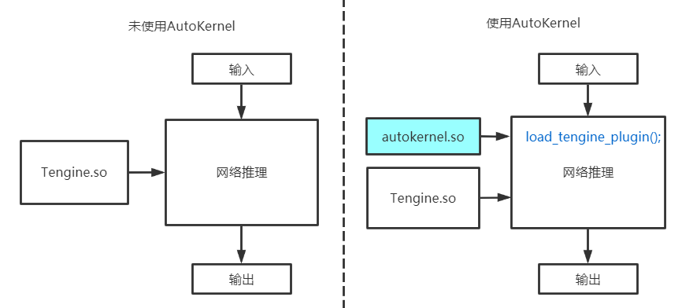
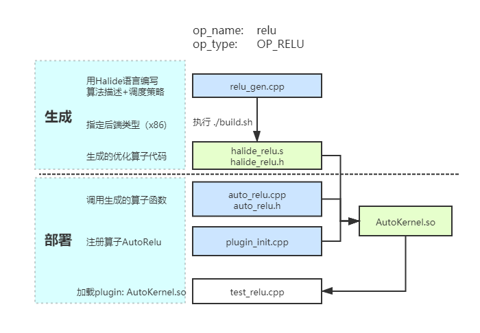

# AutoKernel Plugin插件指南

在这个教程中，我们将会介绍AutoKernel Plugin是什么，AutoKernel的工作流程，并以Relu算子为例，介绍如何添加新算子。为了减少开发者添加新算子的时间，目前我们提供了添加算子的模板文件以及相应的脚本。

## AutoKernel Plugin是什么
Autokernel Plugin是一个相对独立的插件，只依赖于Tengine的算子头文件，不依赖于Tengine库。它实现了将AutoKernel Generator生成优化的算子代码，以Plugin的形式集成进Tengine推理框架中，实现自动优化算子的一键部署。整个过程不需要重新编译Tengine库，只需要独立编译Plugin的动态库，在运行时加载Autokernel Plugin的库，就能调用自动生成的算子实现。

下面的图展示了使用AutoKernel前后的变化，只需要在运行时添加一行代码,加载autokernel plugin的动态库:
```cpp
load_tengine_plugin();
```



AutoKernel Plugin做的工作。主要工作包含：
- 算子封装成Tengine的算子接口
- 算子注册进Tengine的算子库
- 编译生成plugin动态库，调用的时候加载动态库


## 工作流程



AutoKernel的工作流程主要分为两个步骤：
1. 生成：编写算法描述和调度策略，生成相应后端的优化算子代码

2. 部署：将生成的优化算子代码通过plugin的形式集成进Tengine


Autokernel项目提供了卷积算子的两个实现
- direct_conv: 直接卷积实现
- im2col_conv：im2col+gemm的卷积实现

首先看一下目录结构：
```bash
cd AutoKernel/autokernel_plugin/src
#if tree not installed, apt-get update & apt-get install tree
tree . 
```

可以看到这两个算子的目录结构
```
.
|-- CMakeLists.txt
|-- direct_conv
|   |-- build.sh
|   |-- direct_conv.cpp
|   |-- direct_conv.h
|   `-- direct_conv_gen.cc
|-- im2col_conv
|   |-- build.sh
|   |-- im2col_conv.cpp
|   |-- im2col_conv.h
|   `-- im2col_conv_gen.cc
`-- plugin_init.cpp
```
* `xxx_gen.cpp`是用于生成代码的文件,里面包含了用Halide语言描述的算子计算过程和调度策略
* `build.sh`是用于编译生成文件`xxx_gen.cpp`,并制定输出的后端target
* `op.cpp`, `op.h`是用Tengine的op接口封装的算子实现，里面调用了自动生成的算子函数
* `plugin_init.cpp`是用于将auto_op注册进Tengine的算子库里


### 1.生成
`xxx_gen.cpp`是用于生成代码的文件，里面包含了用Halide语言描述的算子计算过程和调度策略
```cpp
// algorithm
Halide.Func(i,j)=...

// schedule
func.tile().reorder().parallel() ...
```
我们提供了生成的编译脚本, 以direct_conv算子为例,`build.sh`脚本如下：
```bash
g++ direct_conv_gen.cc ../../common/GenGen.cpp \
	-I /workspace/Halide/halide-build/include/ \
	-L /workspace/Halide/halide-build/src \
	-lHalide -std=c++11 -fno-rtti \
	-o direct_conv_gen

./direct_conv_gen -g halide_direct_conv -e c_header,assembly -o . target=host
```
该脚本自动链接的Halide的库和头文件，生成可执行程序`direct_conv_gen`，执行生成操作需要指定生成的一些参数：

- -g 函数名
- -e 选项可以配置生成多种类型文件，这里生成汇编和头文件供tengine调用，支持的文件类型如下：
  
    [assembly, bitcode, cpp, h, html, o, static_library, stmt, cpp_stub, schedule, registration, featurization, pytorch_wrapper]

- -o 输出路径
- target选项用于指定后端类型，可选如下：

    targets[] = {"arm-32-android", "arm-32-ios", "arm-32-linux", "arm-64-android", "arm-64-ios", arm-64-linux", "x86-32-linux", "x86-32-osx", "x86-32-windows", "x86-64-linux", "x86-64-osx", "x86-64-windows", "wasm-32-wasmrt"};

我们提供了一键生成所有算子的生成代码
```
cd AutoKernel/autokernel_plugin
chmod +x -R .
./scripts/generate.sh  #自动生成算子汇编文件
```
此时再查看src目录，可以发现该目录多了自动生成的汇编文件和头文件
```
.
|-- CMakeLists.txt
|-- direct_conv
|   |-- build.sh
|   |-- direct_conv.cpp
|   |-- direct_conv.h
|   |-- direct_conv_gen
|   |-- direct_conv_gen.cc
|   |-- halide_direct_conv.h
|   `-- halide_direct_conv.s
|-- im2col_conv
|   |-- build.sh
|   |-- halide_im2col_conv.h
|   |-- halide_im2col_conv.s
|   |-- im2col_conv.cpp
|   |-- im2col_conv.h
|   |-- im2col_conv_gen
|   `-- im2col_conv_gen.cc
`-- plugin_init.cpp
```
### 2.部署

部署阶段需要：
1. 用Tengine的op接口封装的算子实现，调用自动生成的算子函数
2. 将auto_op注册进Tengine的算子库里
3. 一键编译 `libAutoKernel.so`
4. 运行调用plugin动态库


```
mkdir build
cd build
cmake ..
make -j4
```
运行测试
```
cd AutoKernel/autokernel_plugin
./build/tests/tm_classification -n squeezenet
```
运行结果：

```
AutoKernel plugin inited
function:autokernel_plugin_init executed

...

Repeat 1 times, avg time per run is 55.932 ms
max time is 55.932 ms, min time is 55.932 ms
--------------------------------------
0.2732 - "n02123045 tabby, tabby cat"
0.2676 - "n02123159 tiger cat"
0.1810 - "n02119789 kit fox, Vulpes macrotis"
0.0818 - "n02124075 Egyptian cat"
0.0724 - "n02085620 Chihuahua"
--------------------------------------
ALL TEST DONE
```
## 快速添加算子
本教程将以Relu算子为例，演示如何快速开发Tengine可用的自动优化算子。


### 1.执行`register_op.sh`，自动生成模板文件
我们提供了一个快速生成算子的脚本文件，根据模板生成这两个步骤需要的源文件和编译脚本。
```
cd AutoKernel/autokernel_plugin
chmod +x -R . 
./scripts/register_op.sh
```
根据提示填入：
```
op_name: relu
op_type: OP_RELU
```
可得到文件目录如下：
```
src/relu/relu.cpp
src/relu/relu.h
src/relu/relu_gen.cc
src/relu/build.sh
```
### 2.生成：编辑生成文件`relu_gen.cc`
该文件用于生成算子汇编代码。使用Halide语言描述算子的计算过程和调度策略schedule。
该示例中，schedule默认为空。

```
class halide_relu:public Halide::Generator<halide_relu>{
public:
    // args
    Input<Buffer<float>> input{"input", 4};
    Input<int> param{"param"};

    Output<Buffer<float>> output{"output", 4};

    void generate()
    {
        /* THE ALGORITHM */
        Var w("w"), h("h"), c("c"), n("n");
        Func halide_relu("halide_relu");
        halide_relu(w, h, c, n) = input(w, h, c, n);

        output(w, h, c, n) = select(param >= 0, max(param, halide_relu(w, h, c, n)), halide_relu(w, h, c, n));
    }

    void schedule()
    {
        /* THE SCHEDULE */
    }
};

```
### 3.部署：编辑`auto_relu.cpp`,一键编译生成`AutoKernel.so`

```
./scripts/generate.sh	# 一键生成所有算子所需的.s .h文件
mkdir build
cd build
cmake ..
make -j4
```

### 4.测试

测试用例仅供参考 [data/04_test_relu.cpp](data/04_test_relu.cpp)

```
#include "HalideBuffer.h"
#include <iostream>
#include "halide_relu.h"

int main(int argc, char **argv)
{
    int C = 1, W = 4, H = 4, N = 1;
    Halide::Runtime::Buffer<float> input_tensor(nullptr, W, H, C, N);
    Halide::Runtime::Buffer<float> output_tensor(nullptr, W, H, C, N);
    input_tensor.allocate();
    output_tensor.allocate();
    input_tensor.for_each_value([](float &x) {
        x = 2.0 * rand() / RAND_MAX - 1.0;
    });

    output_tensor.for_each_value([](float &x) {
        x = 2.0 * rand() / RAND_MAX - 1.0;
    });

    halide_relu(input_tensor, 0, output_tensor);

    printf("input:\n");
    for (int c = 0; c < input_tensor.dim(3).extent(); c++) {
        for (int z = 0; z < input_tensor.channels(); z++) {
            for (int y = 0; y < input_tensor.height(); y++) {
                for (int x = 0; x < input_tensor.width(); x++) {
                    std::cout<<input_tensor(x,y,z,0)<<" ";
                }
                std::cout<<"\n";
            }
            std::cout<<"\n";
        }
    }
    
    printf("output:\n");
    for (int c = 0; c < output_tensor.dim(3).extent(); c++) {
        for (int z = 0; z < output_tensor.channels(); z++) {
            for (int y = 0; y < output_tensor.height(); y++) {
                for (int x = 0; x < output_tensor.width(); x++) {
                    std::cout<<output_tensor(x,y,z,0)<<" ";
                }
                std::cout<<"\n";
            }
            std::cout<<"\n";
        }
    }

    return 0;
}
```
把该测试代码`test_relu.cpp`放在 AutoKernel/autokernel_plugin/build/目录下，然后编译测试用例:

```
g++ test_relu.cpp ../src/relu/halide_relu.s -I ../include/ -I ../src/relu/ -std=c++11 -lpthread -ldl -O3 -o relu_run
```
执行得到结果
```
./relu_run
input:
0.680375 -0.211234 0.566198 0.59688 
0.823295 -0.604897 -0.329554 0.53645
-0.444451 0.10794 -0.0452059 0.25774
-0.270431 0.0268018 0.904459 0.83239

output:
0.680375 0 0.566198 0.59688 
0.823295 0 0 0.536459 
0 0.10794 0 0.257742 
0 0.0268018 0.904459 0.83239 
```


