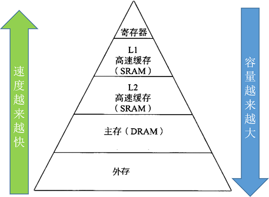

# Halide调度策略Schedule
本教程将讲解以下schedules。每个schedule除了给出C语言的伪代码，更深入讲解了为何这个schedule能有优化效果，认识schedule的优化本质。

本教程配套的代码是：[data/05_loop_schedule.py](data/05_loop_schedule.py)。

  - reorder
  - split
  - fuse
  - tile
  - vectorize
  - unroll
  - parallel
  - compute_at
  - compute_root
## 优化宗旨

1.提高局部性，提高缓存命中率

    下图展示了一个典型的存储器层次结构，主存是比较大的存储空间，但速度慢，缓存的速度要快很多，但是容量小。因此优化策略是提高局部性，使得数据尽可能在缓存中，提高缓存命中率。

2.提高并行性：指令集并行，数据级并行，任务级并行




## Halide调试接口
Halide的函数提供了一个调试打印循环调度策略的接口：
```
func.print_loop_nest()
```
一个简单的函数为例，查看循环的遍历顺序
```python
def origin():
    x, y = hl.Var("x"), hl.Var("y")
    w,h = 8,8
    func = hl.Func("func_origin")
    func[x,y] = x + 10*y
    out = func.realize(w, h)
    func.print_loop_nest()
```
运行结果：
```
    produce func_origin:
    for y:
      for x:
        func_origin(...) = ...
```

---------------------

下面开始详细讲解每个调度策略Schedule。

## fuse 合并
```cpp
# 合并之前
min = a[0];
for (i=0; i<n; i++)
    if (a[i]<min)
       min = a[i];
max = a[0];
for (i=0; i<n; i++)
    if (a[i]>max)
       max = a[i];

# 合并之后
min = a[0];
max = a[0];
for (i=0; i<n; i++){
    if (a[i]<min)
       min = a[i];
    if (a[i]>max)
       max = a[i];
}

```
fuse操作的本质是复用两个独立循环的数据。每一次从主内存获取数据时，CPU会将该数据以及其邻近的数据加载到缓存中，以便利访问的局部性（locality of reference)。如果循环大小N足够大，独立两个循环访问数据可能会造成第二个循环访问数据时发生缓存缺失（cache miss）。合并两个循环的好处是可以减少cache miss的发生。

以下调用Halide的fuse:
```
def fuse():
    func = hl.Func("func_fuse")
    func[x,y] = x + 10*y

    xy_fuse = hl.Var("xy_fuse")
    func.fuse(x,y,xy_fuse)
    out = func.realize(w, h)
    func.print_loop_nest()
'''
运行结果：
```
    produce func_fuse:
      for x.xy_fuse:
        func_fuse(...) = ...
'''
## Unroll 循环展开
```cpp
# 循环展开之前
for(i=0; i<n; i++)
    a[i] = 2 * b[i] + 1;

# 循环展开之后（factor=8)
for(i=0; i<n; i+=8){
    a[i] = 2 * b[i] + 1;
    a[i+1] = 2 * b[i+1] + 1;
    a[i+2] = 2 * b[i+2] + 1;
    a[i+3] = 2 * b[i+3] + 1;
    a[i+4] = 2 * b[i+4] + 1;
    a[i+5] = 2 * b[i+5] + 1;
    a[i+6] = 2 * b[i+6] + 1;
    a[i+7] = 2 * b[i+7] + 1;
}
```
循环展开的目的是：使得更充分利用寄存器，减少循环时每个操作内存加载和保存的次数。提高寄存器的利用率，充分利用寄存器来缓存数据，这样可以大大减少访问内存的延迟，从而有效提升内存带宽。

循环展开有一个参数(unroll factor)，这个参数的设置策略是：根据数据类型，使得匹配硬件的cache line大小。比如cache line是64 bytes, 那么设置 unroll factor为 9或者10就不那么合适了，一般数据类型是 4byte或者8byte, 那么设置这个参数为8或者16是比较合适的，因为这样刚好一次循环展开的内存读取大小是大概一个cache line的大小。

以下调用Halide的unroll:
```
def unroll():
    func = hl.Func("func_unroll")
    func[x,y] = x + 10*y

    factor = 2
    func.unroll(x,factor)
    out = func.realize(w, h)
    func.print_loop_nest()
```
运行结果：
```
    produce func_unroll:
    for y:
      for x.x:
        unrolled x.v1 in [0, 1]:
          func_unroll(...) = ...
```
## Vectorize 向量化
```
# 向量化之前
for(i=0;i<100;i++)
    a[i]= b[i] + 1

# 向量化之后
for(i=0;i<100;i+=4)
    a[i:i+4]= b[i:i+4] + 1
```
向量化是把几个标量计算（scale)转换为一个向量计算（vector),充分利用SIMD向量指令。大部分现代CPU支持SIMD（Single Instruction Multiple Data，单指令流多数据流）。在同一个CPU循环中，SIMD可在多个值上同时执行相同的运算/指令（如加、乘等）。如果我们在4个数据点上同时运行SIMD指令，就会直接实现4倍的加速。

以下调用Halide的vectorize:
```
def vectorize():
    func = hl.Func("func_vectorize")
    func[x,y] = x + 10*y

    factor = 4
    func.vectorize(x,factor)
    out = func.realize(w, h)
    func.print_loop_nest()
```
运行结果：
```
    produce func_vectorize:
    for y:
      for x.x:
        vectorized x.v0 in [0, 3]:
          func_vectorize(...) = ...
```
## reorder 
```cpp
# reorder之前
for(j=0; j<m; j++)
    for(i=0; i<n; i++)
        a[i][j] = b[i][j] + c[i][j];

# reoder之后
for(i=0; i<n; i++)
    for(j=0; j<m; j++)
        a[i][j] = b[i][j] + c[i][j];
```
reorder操作是交换两个嵌套循环的顺序，使得最内层的内存访问友好。比如一个二维矩阵的数据保存是row-major顺序（行主序作为存储顺序）。reorder调整循环顺序后，可以使得矩阵的数据访问是row-by-row地访问，这样的访问和cache的预取是吻合的，提高了数据的局部性。

以下调用Halide的reoder:
```
def reorder():
    func = hl.Func("func_reorder")
    func[x,y] = x + 10*y
    func.reorder(y,x)
    out = func.realize(w, h)
    func.print_loop_nest()
```
运行结果：
```
    produce func_reorder:
    for x:
      for y:
        func_reorder(...) = ...
    '''
```
## parallize 并行化
```
# 并行化之前
for(i=0;i<100;i++)
    a[i]= sin(PI*i/100)

# 并行化
Thread 1: 0, 2, 3, ..., 24
        for(i=0;i<25;i++)
            a[i]= sin(PI*i/100)

Thread 2: 25,26,27, ...,49
        for(i=25;i<50;i++)
            a[i]= sin(PI*i/100)

Thread 3: 50,51,52, ...,74
        for(i=50;i<75;i++)
            a[i]= sin(PI*i/100)

Thread 4: 75,76,77, ...,99
        for(i=75;i<100;i++)
            a[i]= sin(PI*i/100)
```
对一个循环并行化是把循环的每次迭代分给多个线程或者处理器去同时处理，每个线程处理通过代码段（loop body),但是处理不同的数据。

## tile 分块

分块的目的同样是为了充分利用缓存。如果原来的循环较大，tile分块改成小块数据去计算，可以使得每次计算的数据都比较舒适地呆在缓存里，不用经历重复的驱逐（在缓存中重复的添加和删除数据，即缓存颠簸 cache thrashing)。

使用Halide的tile要指定分块大小,y_factor, x_factor
```
for y in range(n):
    for x in range(m):
        ...

# 执行 tile
for y in range(n//y_factor):
    for x in range(m//x_factor):
        for yi in range(y_factor):
            for xi in range(x_factor):
                ...
```
下面调用Halide的tile：
```
def tile():
    func = hl.Func("func_tile")
    func[x,y] = x + 10*y

    xo, xi, yo, yi = hl.Var("xo"), hl.Var("xi"),hl.Var("yo"), hl.Var("yi")
    xfactor, yfactor = 4, 8
    func.tile(x,y,xo,yo,xi,yi,xfactor,yfactor)
    out = func.realize(w, h)
    func.print_loop_nest()
```
运行结果：
```
    produce func_tile:
    for y.yo:
      for x.xo:
        for y.yi in [0, 7]:
          for x.xi in [0, 3]:
            func_tile(...) = ...
```
后续的几个schedule
  - compute_at
  - compute_root
  - update

请大家自己执行[data/05_loop_schedule.py](data/05_loop_schedule.py)的代码，欢迎提交补充文档