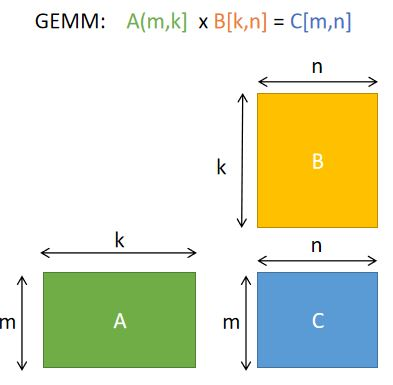
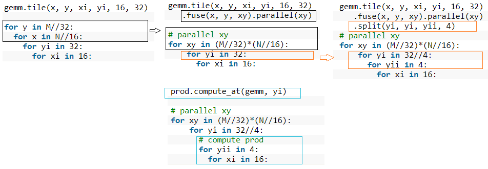
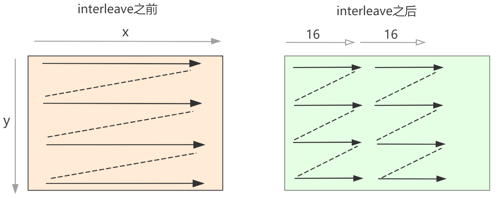

# GEMM调度策略优化指南

本教程将演示如何通过调度策略，在x86 CPU上把gemm的性能提升200+倍。

## 优化宗旨：
1.提高局部性，提高缓存命中率

2.提高并行性，充分利用SIMD进行指令向量化和多核心并行

---------------
## 代码
- [data/06_gemm_optimization.cpp](data/06_gemm_optimization.cpp)
- [data/06_build.sh](data/06_build.sh)

以下代码结果是在Intel(R) Core(TM) i9-9900K CPU @ 3.60GHz的电脑执行的，cache line的大小是64 bytes。

执行`./build.sh [step]`, step 可选 1 - 7

首先执行优化前和优化后的代码，看看优化效果
```bash
root@bd3faab0f079:/AutoKernel/doc/tutorials/data# ./06_build.sh 1
step =  1
M N K = 640 640 640     err 0.00        [rep 50] autokernel | blas      240.8523 ms     1.1376 ms
root@bd3faab0f079:/AutoKernel/doc/tutorials/data# ./06_build.sh 7
step =  7
M N K = 640 640 640     err 0.00        [rep 50] autokernel | blas      1.2131 ms       1.1390 ms
```
可以看到优化后比优化前性能提升了200+倍，autokernel的性能已经接近优化计算库OpenBLAS的性能。

源码路径下有编译和执行脚本 build.sh，执行脚本要指定优化步骤step，可选的step是从1 到7，其中step= 1 是默认不优化的，step=7是最极致优化的。下面将详细介绍每个优化步骤。
## STEP 1



GEMM计算描述如下
```cpp
    Var x,y;
    RDom k(0, K);
    Func gemm("gemm");

    //1: default
    gemm(x, y) += A(k, y) * B(x, k);
```

step1 默认不带schedule调度策略优化。

执行得到结果
```bash
root@bd3faab0f079:/AutoKernel/doc/tutorials/data# ./06_build.sh 1
step =  1
M N K = 640 640 640     err 0.00        [rep 50] autokernel | blas      240.8523 ms     1.1376 ms
```
## STEP2
这一步我们采用分块tile。分块的目的是为了充分利用缓存。如果原来的循环较大，tile分块改成小块数据去计算，可以使得每次计算的数据都比较舒适地呆在缓存里，不用经历重复的驱逐（在缓存中重复的添加和删除数据)。分块后进行reorder操作，交换两个嵌套循环的顺序，目的是最内层的内存访问友好。我们按照x,y维度划分成16x8的小分块去计算:

```cpp
    //step2 : tile
    gemm.update()
        .tile(x, y, xo, yo, xi, yi, 16, 8)
        .reorder(xi, yi, k, xo, yo);
```
执行结果
```bash
root@bd3faab0f079:/AutoKernel/doc/tutorials/data# ./06_build.sh 2
step =  2
M N K = 640 640 640     err 0.00        [rep 50] halide | blas  81.8148 ms      1.1281 ms
```
性能从`240ms`优化到`82ms`，提升了近3倍

## STEP3
我们在上一步的基础上增加向量化vectorize。向量化是把几个标量计算（scale)转换为一个向量计算（vector),充分利用SIMD向量指令。大部分现代CPU支持SIMD（Single Instruction Multiple Data，单指令流多数据流）。在同一个CPU循环中，SIMD可在多个值上同时执行相同的运算/指令。
```cpp
     gemm.update()
            .tile(x, y, xo, yo, xi, yi, 16, 8)
            .reorder(xi, yi, k, xo, yo)
            .vectorize(xi, 8);
```
执行结果
```bash
root@bd3faab0f079:/AutoKernel/doc/tutorials/data# ./06_build.sh 3
step =  3
M N K = 640 640 640     err 0.00        [rep 50] autokernel | blas      27.5433 ms      1.1445 ms
```
性能从82ms优化到27ms，又加速了接近3倍。可以看到，围绕前面提到的两条优化宗旨：优化内存访问和提高并行性，从step1到step3，性能已经提升了近9倍。
## STEP4
调度策略在step3的基础上增加并行化parallel。对一个循环并行化是把循环的每次迭代分给多个线程或者处理器去同时处理，每个线程处理通过代码段（loop body),但是处理不同的数据。
```cpp
    gemm(x, y) += A(k, y) * B(x, k);
    gemm.update()
        .tile(x, y, xo, yo, xi, yi, 16, 8)
        .reorder(xi, yi, k, xo, yo)
        .vectorize(xi, 8)
        .parallel(yo);
```
执行结果
```bash
root@bd3faab0f079:/home/chunying/AutoKernel/doc/tutorials# ./06_build.sh 4
step =  4
M N K = 640 640 640     err 0.00        [rep 50] autokernel | blas      7.2605 ms       1.1605 ms
```
增加并行化后，build.sh默认指定四线程，性能直接翻了近4倍，从27ms到7.3ms.


## STEP5
调度策略在上一步的基础上增加unroll展开。如果循环体内的语句没有数据相关依赖，循环展开可以增加并发执行的机会，使得更充分利用寄存器，减少循环时每个操作内存加载和保存的次数。
```cpp
    gemm.update()
        .tile(x, y, xo, yo, xi, yi, 16, 8)
        .reorder(xi, yi, k, xo, yo)
        .vectorize(xi, 8)
        .parallel(yo)
        .unroll(xi)
        .unroll(yi,2);
```
执行结果
```bash
root@bd3faab0f079:/AutoKernel/doc/tutorials/data# ./06_build.sh 5
step =  5
M N K = 640 640 640     err 0.00        [rep 50] autokernel | blas      4.7617 ms       1.1597 ms
```
unroll展开后，性能从`7.3ms`优化到`4.8ms`.
## STEP6
前面的分块成 16 x 8的小kernel, 这一步先划分成 16 x 32的分块，然后把每个分块再分成 16 x 8的子分块。我们把最外层的两层循环合并到一层，并对这一层进行并行化。这一步计算描述多了一个prod函数来定义子分块的计算，prod函数的计算公式和总的gemm是一样的，我们通过 compute_at指定在 yi维度之下计算prod，则prod计算的是 16x8的小kernel, 大致逻辑如下：


总的代码如下
```cpp
    Func prod;
    prod(x, y) += A(k, y) * B(x, k);
    gemm(x, y) = prod(x, y);

    gemm.tile(x, y, xi, yi, 16, 32)
        .fuse(x, y, xy).parallel(xy)
        .split(yi, yi, yii, 4)
        .vectorize(xi, 8)
        .unroll(xi)
        .unroll(yii);

    prod.compute_at(gemm, yi)
        .vectorize(x, 8).unroll(y);

    prod.update()
        .reorder(x, y, k)
        .vectorize(x, 8)
        .unroll(x)
        .unroll(y)
        .unroll(k, 2);
```
执行结果
```bash
root@bd3faab0f079:/AutoKernel/doc/tutorials/data# ./06_build.sh 6
step =  6
M N K = 640 640 640     err 0.00        [rep 50] autokernel | blas      3.1824 ms       1.1373 ms
```
这一步距离STEP1性能已经优化了近80倍了，性能越来越接近OpenBlas了。
## STEP 7
这一步添加的操作是对矩阵B进行数据重排，使得在计算小kernel 16x8时，内存读取更顺畅。因为小kernel的x维度是按照16划分的，因此重排数据B的x维度也是按照16重排。

总的代码如下
```cpp
    Func B_interleave("B"), Bs("Bs");
    Bs(x, y, xo) = B(xo * 16 + x, y);
    B_interleave(x, y) = Bs(x % 16, y, x / 16);

    Func prod;
    prod(x, y) += A(k, y) * B_interleave(x, k);
    gemm(x, y) = prod(x, y);

    gemm.tile(x, y, xi, yi, 16, 32)
        .fuse(x, y, xy).parallel(xy)
        .split(yi, yi, yii, 4)
        .vectorize(xi, 8)
        .unroll(xi)
        .unroll(yii);

    prod.compute_at(gemm, yi)
        .vectorize(x, 8).unroll(y);

    prod.update()
        .reorder(x, y, k)
        .vectorize(x, 8)
        .unroll(x)
        .unroll(y)
        .unroll(k, 2);
    Bs.compute_root()
        .split(y, yo, yi, 16)
        .reorder(x, yi, xo, yo)
        .unroll(x)
        .vectorize(yi).parallel(yo, 4);
```
执行结果
```bash
root@bd3faab0f079:/AutoKernel/doc/tutorials/data# ./06_build.sh 7
step =  7
M N K = 640 640 640     err 0.00        [rep 50] autokernel | blas      1.1957 ms       1.1425 ms
```
性能已经与OpenBlAS差不多了，距离STEP1已经加速了200+倍了。
